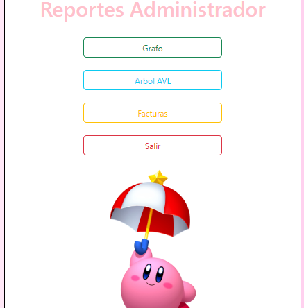
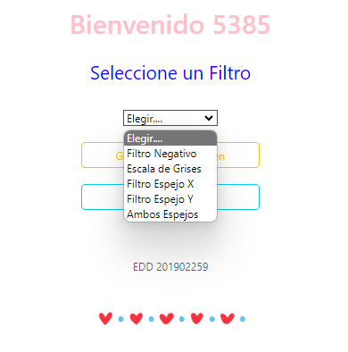
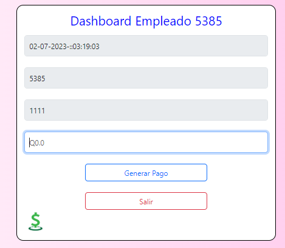
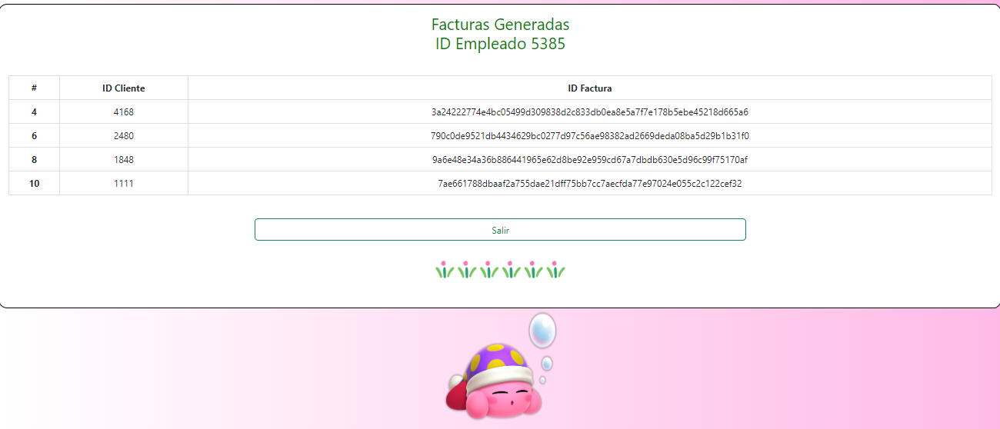

# EDD_VJ1S2023_PY_201902259
# EDD Creative
## FASE 1

### Objetivo General
Aplicar los conocimientos del curso Estructuras de Datos en el desarrollo de
las diferentes estructuras de datos y los diferentes algoritmos de
manipulación de la información en ellas.
#### Objetivos Específicos
1. Utilizar el lenguaje Go para implementar estructuras de datos lineales
2. Utilizar la herramienta Graphviz para graficar las estructuras de datos.
3. Definir e implementar algoritmos de ordenamiento, búsqueda e inserción para
las listas enlazadas.


### Manual Técnico

#### Funciones más relevantes

##### main.go
###### Función main()
Peticiones

```go
app.Post("/login", func(c *fiber.Ctx) error {
		var usuario Peticiones.Login
		c.BodyParser(&usuario)
		if usuario.Username == "ADMIN_201902259" && usuario.Password == "Admin" {
			return c.JSON(&fiber.Map{
				"status": "400",
			})
		} else {
			if ListaEmpleado.Inicio != nil {
				if ListaEmpleado.Buscar(usuario.Username, usuario.Password) {
					VerFacturasRealizadas = &TablaHash.TablaHash{Capacidad: 5, Utilizacion: 0}
					VerFacturasRealizadas.NewTablaHash()
					EmpleadoLogeado = usuario.Username
					return c.JSON(&fiber.Map{
						"status": "200",
					})
				}
			}
		}
		return c.JSON(&fiber.Map{
			"status": "404",
		})
	})
```
En esta petición se reciben los datos del usuario que provienen de login.js y se realizan las respectivas validaciones de inicio de sesión.

# 
```go
app.Post("/cargarempleados", func(c *fiber.Ctx) error {
		var nombreArchivo Peticiones.Archivo
		c.BodyParser(&nombreArchivo)
		fmt.Println(nombreArchivo)
		ListaEmpleado.LeerArchivo(nombreArchivo.Nombre)
		return c.JSON(&fiber.Map{
			"status": 200,
		})
	})
```
En el metodo cargarempleados se reciben los empleados que provienen del archivo de empleados.csv y se agregan a una lista.

#

```go
app.Post("/cargarpedidos", func(c *fiber.Ctx) error {
		var pedidosNuevos Peticiones.ArbolPeticion
		c.BodyParser(&pedidosNuevos)
		for i := 0; i < len(pedidosNuevos.Pedidos); i++ {
			ArbolPedidos.InsertarElemento(pedidosNuevos.Pedidos[i].Id_Cliente, pedidosNuevos.Pedidos[i].Nombre_Imagen)
		}
		ArbolPedidos.RecorridoInorden(ArbolPedidos.Raiz, PedidosCola)
		return c.JSON(&fiber.Map{
			"status": 200,
			"cola":   PedidosCola,
		})
	})
```
El metodo cargarpedidos, lee un archivo JSON, que contiene el ID de cada cliente y el pedido de imagen realizado por el mismo.


#
```go
app.Get("/reporte-arbol", func(c *fiber.Ctx) error {
		ArbolPedidos.Graficar()
		var imagen Peticiones.RespuestaImagen = Peticiones.RespuestaImagen{Nombre: "Reporte/arbolAVL.jpg"}
		/*INICIO*/
		imageBytes, err := ioutil.ReadFile(imagen.Nombre)
		if err != nil {
			return c.JSON(&fiber.Map{
				"status": 404,
			})
		}
		// Codifica los bytes de la imagen en base64
		imagen.Imagenbase64 = "data:image/jpg;base64," + base64.StdEncoding.EncodeToString(imageBytes)
		return c.JSON(&fiber.Map{
			"status": 200,
			"imagen": imagen,
		})
	})
```
Este metodo grafica el arbol desde la estructura ArbolAVL.go y manda a llamar una petición para leer la imagen generada y convertirla a base 64 para de esa manera, mostrarla en el frontend.

#
```go
app.Post("/aplicarfiltro", func(c *fiber.Ctx) error {
		var tipo Peticiones.PeticionFiltro
		c.BodyParser(&tipo)
		fmt.Println(tipo)
		tipo.NombreImagen = PedidosCola.Primero.Pedido.Nombre_Imagen
		fmt.Println(tipo)
		fmt.Println(tipo.Tipo)
		fmt.Println(tipo.NombreImagen)
		switch tipo.Tipo {
		case 1:
			MatrizFiltro.LeerInicial("csv/"+tipo.NombreImagen+"/inicial.csv", tipo.NombreImagen)
			MatrizFiltro.Negativo(tipo.NombreImagen + "Negativo")
			FiltrosColocados += "Negativo, "
		case 2:
			MatrizFiltro.LeerInicial("csv/"+tipo.NombreImagen+"/inicial.csv", tipo.NombreImagen)
			MatrizFiltro.EscalaGrises(tipo.NombreImagen + "Grises")
			FiltrosColocados += "Grises, "
		case 3:
			MatrizFiltro.LeerInicial("csv/"+tipo.NombreImagen+"/inicial.csv", tipo.NombreImagen)
			MatrizFiltro.RotacionX()
			MatrizFiltro.GenerarImagen(tipo.NombreImagen + "RX")
			FiltrosColocados += "Eje X, "
		case 4:
			MatrizFiltro.LeerInicial("csv/"+tipo.NombreImagen+"/inicial.csv", tipo.NombreImagen)
			MatrizFiltro.RotacionY()
			MatrizFiltro.GenerarImagen(tipo.NombreImagen + "RY")
			FiltrosColocados += "Eje Y, "
		case 5:
			MatrizFiltro.LeerInicial("csv/"+tipo.NombreImagen+"/inicial.csv", tipo.NombreImagen)
			MatrizFiltro.RotacionDoble()
			MatrizFiltro.GenerarImagen(tipo.NombreImagen + "RDoble")
			FiltrosColocados += "Doble,  "
		}
		return c.JSON(&fiber.Map{
			"status": 200,
		})
	})
```
El metodo POST aplicarfiltro permite recibir qué filtro se desea por medio de un número que se le asigna a cada uno, para luego comparar en un case, a que caso debe acceder para realizar la nueva imagen.

#
```go
app.Get("/obtenerPedido", func(c *fiber.Ctx) error {
		return c.JSON(&fiber.Map{
			"datos": PedidosCola.Primero.Pedido,
		})
	})
```
El metodo GET de obtenerPedido, permite recibir los datos de los pedidos que anteriormente fueron ingresados a una cola de clientes.

#
```go
app.Post("/generarfactura", func(c *fiber.Ctx) error {
		var nuevoBloque Peticiones.BloquePeticion
		c.BodyParser(&nuevoBloque)
		FacturasRealizadas.InsertarBloque(nuevoBloque.Timestamp, nuevoBloque.Biller, nuevoBloque.Customer, nuevoBloque.Payment)
		PedidosCola.Descolar()
		VerFacturasRealizadas.NewTablaHash()
		FacturasRealizadas.InsertarTabla(VerFacturasRealizadas, EmpleadoLogeado)
		MatrizOriginal = &Matriz.Matriz{Raiz: &Matriz.NodoMatriz{PosX: -1, PosY: -1, Color: "Raiz"}}
		MatrizFiltro = &Matriz.Matriz{Raiz: &Matriz.NodoMatriz{PosX: -1, PosY: -1, Color: "Raiz"}}
		return c.JSON(&fiber.Map{
			"datos": FacturasRealizadas.Bloques_Creados,
		})
	})
```
Este metodo permite leer cada factura, para generar un bloque, seguido de esto, el cliente sale de la cola y se genera una tabla hash con los datos de la misma codificados.

#
```go
app.Get("/facturaempleado", func(c *fiber.Ctx) error {

		return c.JSON(&fiber.Map{
			"status":  200,
			"factura": VerFacturasRealizadas.Tabla,
		})
	})
```
Permite visualizar las facturas en la tabla Hash.

##### Estructuras
###### ArbolAVL
```go
func (a *Arbol) RecorridoInorden(raiz *NodoArbol, colaActual *ColaPedidos.Cola) {
	if raiz != nil {
		if raiz.Izquierdo != nil {
			a.RecorridoInorden(raiz.Izquierdo, colaActual)
		}
		colaActual.Encolar(raiz.Valor.Id_Cliente, raiz.Valor.Nombre_Imagen)
		fmt.Print(" ", raiz.Valor, " ")
		if raiz.Derecho != nil {
			a.RecorridoInorden(raiz.Derecho, colaActual)
		}

	}
}
```
Esta función recorre el Arbol iniciando por el nodo izquierdo, luego busca la raíz y por último el lado derecho, a partir de ese recorrido se crea la cola de pedidos.

###### Blockchain
```go
func (b *BlockChain) InsertarBloque(fecha string, biller string, customer string, payment string) {
	cadenaFuncion := strconv.Itoa(b.Bloques_Creados) + fecha + biller + customer + payment
	hash := SHA256(cadenaFuncion)
	if b.Bloques_Creados == 0 {
		datosBloque := map[string]string{
			"index":        strconv.Itoa(b.Bloques_Creados),
			"timestamp":    fecha,
			"biller":       biller,
			"customer":     customer,
			"payment":      payment,
			"previoushash": "0000",
			"hash":         hash,
		}
		nuevoBloque := &NodoBloque{Bloque: datosBloque}
		b.Inicio = nuevoBloque
	} else {
		aux := b.Inicio
		for aux.Siguiente != nil {
			aux = aux.Siguiente
		}
		datosBloque := map[string]string{
			"index":        strconv.Itoa(b.Bloques_Creados),
			"timestamp":    fecha,
			"biller":       biller,
			"customer":     customer,
			"payment":      payment,
			"previoushash": aux.Bloque["hash"],
			"hash":         hash,
		}
		nuevoBloque := &NodoBloque{Bloque: datosBloque, Anterior: aux}
		aux.Siguiente = nuevoBloque
	}
	b.Bloques_Creados++
}
```
En la función InsertarBloque, se tienen como parametros los componentes del bloque, se llama la funcion SHA256 que codifica la cadena del bloque, mismos que se leen como se muestra y terminado ese bloque se avanza al siguiente.


###### TablaHash
```go
func (t *TablaHash) calculoIndice(id_cliente int, multiplicador int) int {
	indice := (59*id_cliente + 201902259*multiplicador) % t.Capacidad
	return indice
}

func (t *TablaHash) capacidad_Tabla() {
	auxCap := float64(t.Capacidad) * 0.6
	if t.Utilizacion > int(auxCap) {
		t.Capacidad = t.nuevaCapacidad()
		t.Utilizacion = 0
		t.reInsertar()
	}
}
```
Debido a que se pedía calcular el índice por medio del carnet se calculó de esa manera, la capacidad requerida era del 60%.


### Manual de Usuario

La empresa EDD Creative, proporciona una aplicación de escritorio capaz de generar imágenes en píxeles, esto debido a que imágenes con extensiones generales como jpg, png, svg, llegan a tener un peso
grande en almacenamientos de la nube, por lo cual se opta a generar imágenes creadas por intérpretes de html y css, ya que al ser generadas como código, optimizan el espacio que estos ocupan. La aplicación mantiene una base de datos por medio de archivos csv, que contienen información de los empleados, clientes e imagenes disponibles en el catalogo de la empresa.

## Opciones del Administrador
### Login
#### En el login debe ingresar sus credenciales como administrador, para acceder al dashboard que brinda las opciones del sistema.


### Menu Admin
#### Al iniciar sesión, podrá observar el dashboard del administrador, que le ofrece opciones de carga de archivos, tales como el archivo de empleados y de clientes en cola. También podrá encontrar la opción Reportes que al elegirla se mostrará otra página donde podrá escoger qué reporte desea visualizar.


### Reportes
#### Debe seleccionar el reporte que desea visualizar y este se mostrará en la parte de abajo.



## Opciones del Empleado
#### Al iniciar sesión un empleado, podrá realizar los pedidos de los clientes, aplicando los filtros requeridos, generar facturas y visualizar las mismas en una tabla Hash.


### Aplicacion de Filtros
#### Un empleado puede aplicar los filtros disponibles a una imagen para completar los pedidos de los clientes, seguido de seleccionar el filtro debe presionar Generar Nueva Imagen.


### Generar Facturas
#### En este apartado el empleado únicamente debe rellenar el campo del costo ya que, los otros campos los rellena el sistema.


### Ver Facturas
#### En esta parte se puede visualizar una tabla Hash donde se encuentran las facturas extendidas por él, con los datos importantes del Hash.
