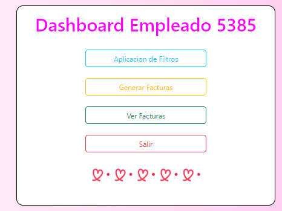

# EDD_VJ1S2023_PY_201902259
# EDD Creative
## FASE 1

### Objetivo General
Aplicar los conocimientos del curso Estructuras de Datos en el desarrollo de
las diferentes estructuras de datos y los diferentes algoritmos de
manipulación de la información en ellas.
#### Objetivos Específicos
1. Utilizar el lenguaje Go para implementar estructuras de datos lineales
2. Utilizar la herramienta Graphviz para graficar las estructuras de datos.
3. Definir e implementar algoritmos de ordenamiento, búsqueda e inserción para
las listas enlazadas.


### Manual Técnico

#### Funciones más relevantes

##### Estructuras/listasimple.go
###### Función Insertar

```go
func (l *ListaEmpleados) Insertar(id string, nombre string, cargo string, password string) {
	nuevoEmpleado := &Empleado{Id: id, Nombre: nombre, Cargo: cargo, Password: password}
	if l.estaVacia() {
		l.Inicio = &NodoLista{empleado: nuevoEmpleado, siguiente: nil}
		l.Longitud++
	} else {
		aux := l.Inicio
		for aux.siguiente != nil {
			aux = aux.siguiente
		}
		aux.siguiente = &NodoLista{empleado: nuevoEmpleado, siguiente: nil}
		l.Longitud++
	}
}
```
En listasimple.go se pueden encontrar las funciones para añadir a un empleado a una lista simple de empleados, así como la estructura de una lista simple y el reporte graficado de la misma.

###### Función Recorrer
```go
func (l *ListaEmpleados) Recorrer(id string, password string) *Empleado {
	if l.estaVacia() {
		return nil
	} else {
		aux := l.Inicio
		for i := 0; i < l.Longitud; i++ {
			if id == aux.empleado.Id && password == aux.empleado.Password {
				return aux.empleado
			}
			aux = aux.siguiente
		}
		return nil
	}
}
```
La función Recorrer() se realizó para leer el id y la contraseña de la lista de empleados para luego comparar esos valores y permitir la validación de usuarios.


##### Estructuras/listadoble.go
###### Función Reporte

```go
func (l *ListaDoble) Reporte() {
	nombreArchivo := "./listadoble.dot"
	nombreImagen := "./listadoble.jpg"
	texto := "digraph lista{\n"
	texto += "rankdir=LR;\n"
	texto += "node[shape = record];\n"
	texto += "nodonull1[label=\"null\"];\n"
	texto += "nodonull2[label=\"null\"];\n"
	aux := l.Inicio
	contador := 0
	texto += "nodonull1->nodo0 [dir=back];\n"
	for i := 0; i < l.Longitud; i++ {
		texto += "nodo" + strconv.Itoa(i) + "[label=\"" + aux.nimagen.Imagen + "\"];\n"
		aux = aux.siguiente
	}
	for i := 0; i < l.Longitud-1; i++ {
		c := i + 1
		texto += "nodo" + strconv.Itoa(i) + "->nodo" + strconv.Itoa(c) + ";\n"
		texto += "nodo" + strconv.Itoa(c) + "->nodo" + strconv.Itoa(i) + ";\n"
		contador = c
	}
	texto += "nodo" + strconv.Itoa(contador) + "->nodonull2;\n"
	texto += "}"
	crearArchivo(nombreArchivo)
	escribirArchivo(texto, nombreArchivo)
	ejecutar(nombreImagen, nombreArchivo)
}
```
La función reporte realiza un gráfico de la lista doble, haciendo que el nodo n apunte a un nodo n+1, seguido del nodo n+1 apuntando al nodo n, para generar de esa manera un grafico de lista doble enlazada.


###### Función Validar Imagen
```go
func (l *ListaDoble) Validarimagen(opcion string) string {
	aux := l.Inicio
	contador := 1
	for i := 0; i < l.Longitud; i++ {
		if opcion == strconv.Itoa(contador) {
			return aux.nimagen.Imagen
		}
		contador++
		aux = aux.siguiente
	}
	return "Opccion no valida"
}
```
Esta función permite validar la seleccion que se hace de la imagen al momento del pedido.


##### Estructuras/listacircular.go
###### Función RecorrerClientes
```go
func (l *ListaCircular) RecorrerClientes(id string, nombre string) *Cliente {
	if l.Longitud == 0 {
		return nil
	} else {
		aux := l.Inicio
		for i := 0; i < l.Longitud; i++ {
			if id == aux.cliente.Id {
				return aux.cliente
			}
			aux = aux.siguiente
		}
		return nil
	}
}
```
La función recorre la lista circular, validando el ID.

###### Función Validar
```go
func (l *ListaCircular) Validar(id string) bool {
	aux := l.Inicio
	for i := 0; i < l.Longitud; i++ {
		if id == aux.cliente.Id {
			return true
		}
		aux = aux.siguiente
	}
	return false
}
```
La función validar permite comparar el id de la lista con el id proporcionado en la cola.


##### Estructuras/cola.go
###### Función RecorrerClientes
```go
func (c *Cola) ObtenerId() string {
	aux := c.Primero
	if aux != nil {
		return aux.cliente.Id
	} else {
		return "Está vacío"
	}
}

func (c *Cola) ObtenerNombre() string {
	aux := c.Primero
	if aux != nil {
		return aux.cliente.Nombre
	} else {
		return "Está vacío"
	}
}

func (c *Cola) ObtenerLongitud() int {
	return c.Longitud
}

func (c *Cola) Enlistar() *Cliente {
	if c.Longitud == 0 {
		return nil
	} else {
		return c.Primero.cliente
	}
}
```
Las funciones anteriores permiten obtener los atributos del cliente que están en cola para asignarlos a la lista, acción que se realiza en la función enlistar.


##### Estructuras/pila.go
###### Función RecorrerClientes
```go
func (p *Pila) Push(idcliente string, Imagen string, idempleado string) {
	if p.Longitud == 0 {
		nuevoNodo := &NodoPila{idcliente: idcliente, Imagen: Imagen, idempleado: idempleado, Siguiente: nil}
		p.Primero = nuevoNodo
		p.Longitud++
	} else {
		nuevoNodo := &NodoPila{idcliente: idcliente, Imagen: Imagen, idempleado: idempleado, Siguiente: p.Primero}
		p.Primero = nuevoNodo
		p.Longitud++
	}
}
```
La función Push inserta un nuevo nodo en la pila, recibe el id del cliente, del empleado en el sistema y el nombre de la imagen a cargar.

##### Estructuras/matriz.go
###### Función RecorrerClientes
```go
```
###### Función
```go
```
###### Función
```go
```
###### Función
```go
```
###### Función
```go
```

### Manual de Usuario

La empresa EDD Creative, proporciona una aplicación de escritorio capaz de generar imágenes en píxeles, esto debido a que imágenes con extensiones generales como jpg, png, svg, llegan a tener un peso
grande en almacenamientos de la nube, por lo cual se opta a generar imágenes creadas por intérpretes de html y css, ya que al ser generadas como código, optimizan el espacio que estos ocupan. La aplicación mantiene una base de datos por medio de archivos csv, que contienen información de los empleados, clientes e imagenes disponibles en el catalogo de la empresa.

## Opciones del Administrador
### Login
#### En el login debe ingresar sus credenciales como administrador, para acceder al dashboard que brinda las opciones del sistema.


### Menu Admin
#### Al iniciar sesión, podrá observar el dashboard del administrador, que le ofrece opciones de carga de archivos, tales como el archivo de empleados, de imagenes, de clientes y de clientes en cola. También podrá encontrar la opción Reportes de Estructuras que al elegirla se generan automaticamente los reportes de las estructuras.

#### Para cargar cada uno de los archivos debe ingresar la ruta del mismo, tal como se muestra en la imagen. Recuerde que el programa solo lee archivos csv.

### Reportes
#### Los reportes se generan automaticamente en la carpeta del programa como una imagen de tipo jpg.
##### Lista de Empleados  (Lista Simple)

##### Lista de Imagenes  (Lista Doble enlazada)

##### Lista de Clientes  (Lista Circular Enlazada)

##### Lista de clientes en espera de ser atendidos  (Cola)

##### Compras  (Pila)


## Opciones del Empleado
#### Al iniciar sesión un empleado, podrá ver las imagenes cargadas en el sistema y realizar los pedidos de los clientes.


### Ver Imagenes
### Realizar Pedido
#### Al realizar un pedido se atiende al primer cliente en la cola. Seguido de este va el sucesor hasta finalizar la cola de pedidos.

#### Para realizar un pedido se debe escoger la imagen el cliente desea, seguido de esto el cliente desaparecerá de la cola, tomando como finalizada su compra.